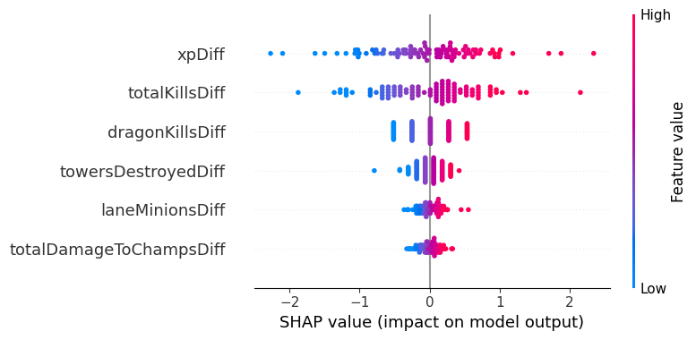

# 🔮 League of Legends Match Predictor - Supervised Learning

> **Autores:** Joaquin Negrete Saab & Pablo Suárez Iglesias
> **Asignatura:** Aprendizaje Automático 1

## 📋 Descripción del Proyecto
Este proyecto tiene como objetivo entrenar un modelo de aprendizaje supervisado capaz de **predecir el equipo ganador** de una partida de League of Legends (LoL) utilizando únicamente información de los **primeros 15 minutos** de juego.

El desafío principal radica en capturar el "efecto bola de nieve" (snowball) inherente al juego y determinar qué variables tempranas (Oro, XP, Kills, Objetivos) son determinantes para el resultado final.

## 💾 Dataset y Preprocesamiento
Utilizamos un dataset de Kaggle que contiene partidas de alto ELO (Diamond a Challenger).
* **Variable Objetivo:** `blueTeamWin` (Binaria: 1 si gana Azul, 0 si gana Rojo).
* **Transformación de Datos:**
    * Se priorizaron las **diferencias** (Blue - Red) sobre los valores absolutos, ya que en LoL la ventaja relativa es más importante que el valor bruto.
    * **Escalado:** Se utilizó `RobustScaler` para manejar los datos atípicos, dado que las partidas tipo "stomp" (muy desequilibradas) son información valiosa y no ruido.
    * **Ingeniería de Características:** Se crearon datasets alternativos eliminando variables directas de "Oro" para reducir la multicolinealidad y estudiar los factores subyacentes (como XP y Kills).

## 🛠 Modelos Evaluados
Se entrenaron y optimizaron mediante `GridSearchCV` y validación cruzada los siguientes modelos:

1.  **Árboles de Decisión:** Alta interpretabilidad, manejó bien la multicolinealidad inicial.
2.  **SVM (Support Vector Machine):** Se probó con kernels lineales y polinomiales. Costoso computacionalmente.
3.  **K-Nearest Neighbors (KNN):** Se utilizó distancia Manhattan y pesos por distancia. El peor modelo.
4.  **Random Forest:** Para comprobar si un modelo de ensamble complejo mejoraba la precisión.
5.  **Regresión Logística:** El modelo seleccionado como ganador.

## 📊 Resultados y "El Techo del 76%"

Tras experimentar con todos los modelos, observamos un fenómeno constante: **todos convergieron en un Accuracy de aproximadamente 75-76%**.

| Modelo | Accuracy (Test) | Observaciones |
| :--- | :---: | :--- |
| Árbol de Decisión | 0.75 | Gold Diff fue la regla raíz dominante. |
| SVM (Lineal) | 0.76 | Sensible a la multicolinealidad. |
| KNN | 0.76 | Computacionalmente ineficiente para este problema. |
| **Regresión Logística** | **0.76** | **Mejor equilibrio entre eficiencia y explicabilidad.** |

### ¿Por qué no sube la precisión?
Concluimos que el 76% representa el **límite de predictibilidad** intrínseco a los primeros 15 minutos. El 24% de error restante corresponde a la varianza no observada del "late game":
* Escalado de campeones.
* Errores humanos tardíos.
* Robos de objetivos (Baron/Elder).

El estado de la partida al minuto 15 determina el resultado en 3 de cada 4 casos, confirmando la importancia del *Early Game*.

## 🏆 Modelo Ganador: Regresión Logística
Seleccionamos la **Regresión Logística** como el mejor modelo por su capacidad de explicar **qué** gana las partidas.

Al utilizar librerías como **SHAP**, descubrimos que aunque el Oro es el predictor obvio, al retirarlo, las variables que realmente impulsan la victoria son:
1.  **Diferencia de Experiencia (xpDiff):** La variable más crítica subyacente.
2.  **Diferencia de Kills:** No solo por el oro, sino por el tiempo que el rival pasa muerto (sin ganar recursos).
3.  **Dragones:** Impacto significativo en ventajas permanentes.



Para un análisis completo de cada modelo y el resultado final, revisar la [memoria](./Memoria%20AA1%20Practica%2002.pdf).

## 🚀 Instalación y Uso

1. Clonar el repositorio:
   ```bash
   git clone [https://github.com/tu-usuario/lol-match-predictor.git](https://github.com/tu-usuario/lol-match-predictor.git)
   ```
2. Instalar dependencias:
    ```bash
    pip install -r requirements.txt
    ```
3. Ejecutar el [notebook de preprocesado](./preproc.ipynb)
4. Ejecutar los notebooks dentro de la carpeta `src/` para reproducir los experimentos.
